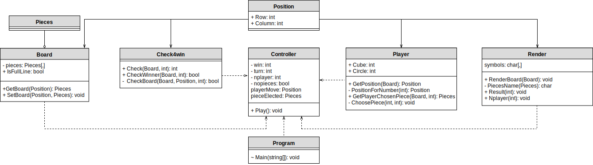
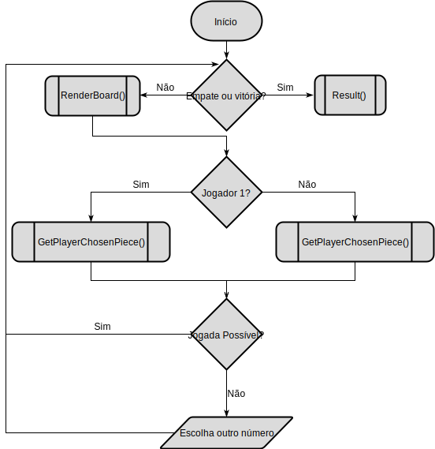

# 1º Projeto de Linguagens de Programação 1

###### Projeto realizado por:
Alejandro Urcera a21703818
Joana Marques a21701929
Pedro Santos a21702907

##### Link do repositório GitHub : https://github.com/aurceramartins/Projeto1LP.git

### Relatório:
O nosso grupo fez o projeto todo em conjunto e depois fomos dividindo o código para cada um de nós fazer commits para o GitHub.

### Solução:
##### Arquitetura:
Separámos o código em várias classes.
Cada classe desepenha uma determinada função no código. 

O `Program` inicializa o jogo. 

A classe `Player` inicializa o número de peças que cada jogador tem, pede o local onde o jogador pretende jogar (coluna) e que peça (quadrado ou cilindro). 

A classe `position` contém a indicação das linhas e das colunas do board e consequentemente, a classe `Board` tem as posições onde o jogador pode jogar e verifica se essas estão livres ou não. 

As peças que o jogador possui estão definidas na enumeração `Pieces`.

A classe `Controler` é o gameloop do jogo e a classe `Render` mostra os resultados. Estes são verificados pelas condições impostas na classe `Check4win`. 

As estruturas de dados que utilizámos no nosso código foi `arrays`, `enumerações`. 

Um dos algoritmos que usámos foi o de verificação de vitória:

  /// 

        /// Cube check when there are two wins at the same time
        /// 

        private int shapeCube = 0;
        /// 

        /// Circle check when there are two wins at the same time
        /// 

        private int shapeCircle = 0;
        /// 

        /// Returns the winner
        /// 

        /// <returns>int Player</returns>
        /// <param name="board">Board.</param>
        /// <param name="nplayer">Nplayer.</param>
        public int Check(Board board, int nplayer)
        {
            ///Checks the winner
            if (CheckWinner(board, nplayer)){
                if (shapeCube == 1){
                    shapeCube = 0;
                    return 1;
                }
                else if(shapeCircle == 1) {
                    shapeCircle = 0;
                    return 2;
                }
                return nplayer; 
            } 
            else return 0;
        }
        /// 

        /// Checks the winner.
        /// 

        /// <returns><c>true</c>, if winner was checked, <c>false</c> otherwise.</returns>
        /// <param name="board">Board.</param>
        /// <param name="nplayer">Nplayer.</param>
        public bool CheckWinner(Board board, int nplayer)
        {
            ///go through the rows arrays.
            for (int i = 6; i >= 0; i--)
            {
                ///go through the columns array.
                for (int j = 6; j >= 0; j--)
                {
                    ///Verify all the possible vertical positions
                    if (j >= 3)
                    {
                        ///calls the CheckBoard method and give 4 positions.
                        if (CheckBoard(board, new Position[] {
                        new Position(i, j),
                        new Position(i, j-1),
                        new Position(i, j-2),
                        new Position(i, j-3) }, nplayer))
                        {
                            return true;
                        }
                    }
                    ///Verify all the possible horizontal positions
                    else if (i >= 3)
                    {
                        ///calls the CheckBoard method and give 4 positions.
                        if (CheckBoard(board, new Position[] {
                        new Position(i, j),
                        new Position(i-1, j),
                        new Position(i-2, j),
                        new Position(i-3, j) }, nplayer))
                        {
                            return true;
                        }
                    }
                    ///Verify all the possible left diagonal positions
                    if (i >= 3 && j >= 3)
                    {
                        ///calls the CheckBoard method and give 4 positions.
                        if (CheckBoard(board, new Position[] {
                        new Position(i, j),
                        new Position(i-1, j-1),
                        new Position(i-2, j-2),
                        new Position(i-3, j-3) }, nplayer))
                        {
                            return true;
                        }
                    }
                    ///Verify all the possible right diagonal positions
                    if (i >= 3 && j <= 3)
                    {
                        ///calls the CheckBoard method and give 4 positions.
                        if (CheckBoard(board, new Position[] {
                        new Position(i, j),
                        new Position(i-1, j+1),
                        new Position(i-2, j+2),
                        new Position(i-3, j+3) }, nplayer))
                        {
                            return true;
                        }
                    }
                }
            }
            return false;
        }
        /// 

        /// Checks the diferent win conditions.
        /// 

        /// <returns><c>true</c>, if board was checked, <c>false</c> otherwise.</returns>
        /// <param name="board">Board.</param>
        /// <param name="positions">Positions.</param>
        /// <param name="nplayer">Nplayer.</param>
        private bool CheckBoard(Board board, Position[] positions, int nplayer)
        {
            ///counters
            int white = 0;
            int cube = 0;
            int circle = 0;
            int red = 0;

            ///go through the 4 given positions
            foreach (Position position in positions)
            {

                ///checks for same color pieces(red pieces)
                if (board.GetBoard(position) == Pieces.RedCircle
                    || board.GetBoard(position) == Pieces.RedCube)
                {
                    ///if threre are 4 red pieces
                    if (red == 3)
                    {
                        //checks if its player 1 
                        if (nplayer == 1)
                        {
                            ///Set the red counter to 0
                            red = 0;
                            return true;
                        }
                    }
                    ///Increases the red counter in 1 value
                    red++;
                }
                else
                {
                    ///set the red counter to 0
                    red = 0;
                }
                ///checks for same shape pieces(cubes)
                if (board.GetBoard(position) == Pieces.RedCube
                    || board.GetBoard(position) == Pieces.WhiteCube)
                {
                    ///if threre are 4 red pieces
                    if (cube == 3)
                    {
                            ///Set the cube counter to 0
                            cube = 0;
                            ///if 1 red wins
                            shapeCube = 1;
                            return true;
                    }
                    ///Increases the cube counter in 1 value
                    cube++;
                }
                else
                {
                    ///set the counter to 0
                    cube = 0;
                }
                ///checks for same shape pieces(circle)
                if (board.GetBoard(position) == Pieces.WhiteCircle
                    || board.GetBoard(position) == Pieces.RedCircle)
                {
                    ///if there are 4 circle pieces
                    if (circle == 3)
                    {
                            ///Set the circle counter to 0
                            circle = 0;
                            ///If 1 white wins
                            shapeCircle = 1;
                            return true;
                    }
                    ///Increases the cicle counter in 1 value
                    circle++;
                }
                else
                {
                    ///set the counter to 0
                    circle = 0;
                }
                ///checks for same color pieces(white pieces)
                if (board.GetBoard(position) == Pieces.WhiteCube
                    || board.GetBoard(position) == Pieces.WhiteCircle)
                {
                    ///if threre are 4 white pieces
                    if (white == 3)
                    {
                        //checks if its player 2 
                        if (nplayer == 2)
                        {
                            ///Set the white counter to 0
                            white = 0;
                            return true;
                        }
                    }
                    ///Increases the white counter in 1 value
                    white++;
                }
                else
                {
                    ///Set the white counter to 0
                    white = 0;
                }
            }
            return false;
        }
    }
}

##### Diagrama UML:

##### Fluxograma:

### Conclusões
Com a realização deste projeto aprendemos a criar diversas classes para organização do código e como fazer um diagrama UML.
Tivemos algumas dificuldades em começar o projeto mas após percebermos a lógica do jogo, já foi mais fácil. A classe do `Check4win` foi a mais complicada de fazer pois há várias maneiras de um jogador ganhar.
### Referências
* <a name="ref3">\[1\]</a> [Tic Tac Toe Game]http://starboundsoftware.com/books/c-sharp/try-it-out/tic-tac-toe
* Discussão sobre o projeto com alguns colegas de turma.